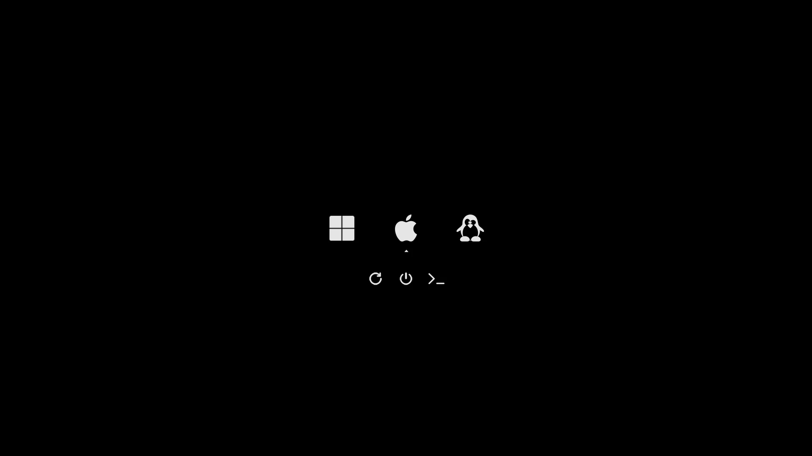

# Minimalistic black rEFInd theme

[rEFInd](http://www.rodsbooks.com/refind/) is a simplistic boot manager for UEFI
based systems. This is a clean and minimal black theme for it.



# Usage

1. Locate your refind EFI directory. This is commonly `/boot/EFI/refind`
    though it will depend on where you mount your ESP and where rEFInd is
    installed. `fdisk -l` and `mount` may help.
2. Create a folder called `themes` inside it, if it doesn't already exist
3. Clone this repository into the `themes` directory.
4. To enable the theme add `include themes/minimal-black/theme.conf` at the end of
    `refind.conf`.

Here's an example menuentry configuration (from the screenshot)

```
# Windows
menuentry "Windows 11" {
    ostype "Windows"
    graphics "on"
    icon /EFI/refind/themes/minimal-black/icons/os_win.png
    volume "EFI"
    loader /EFI/Microsoft/Boot/bootmgfw.efi
}

# macOS
menuentry "macOS" {
    ostype "MacOS"
    graphics "on"
    icon /EFI/refind/themes/minimal-black/icons/os_mac.png
    volume "EFI"
    loader /EFI/OC/OpenCore.efi
}

# CachyOS
# "rootflags=subvol=@" is required for Btrfs
# "loglevel=3" shows error conditions
# "rw" mounts the filesystem in read-write
# "quiet" suppresses most kernel log messages during boot for a clean boot
# "splash" shows a boot splash screen
menuentry "CachyOS" {
    ostype "Linux"
    graphics "on"
    icon /EFI/refind/themes/minimal-black/icons/os_linux.png
    volume "CachyOS"
    loader /@/boot/vmlinuz-linux-cachyos
    initrd /@/boot/initramfs-linux-cachyos.img
    options "root=UUID=09354f10-a3e8-4ec6-a95c-2adbad1735ea rootflags=subvol=@ loglevel=3 rw quiet splash"
}
```

Entries that are autodetected should also show the proper icons.

# Attribution

The OS icons are from [Lightness for burg](http://sworiginal.deviantart.com/art/Lightness-for-burg-181461810) by [SWOriginal](http://sworiginal.deviantart.com/).
